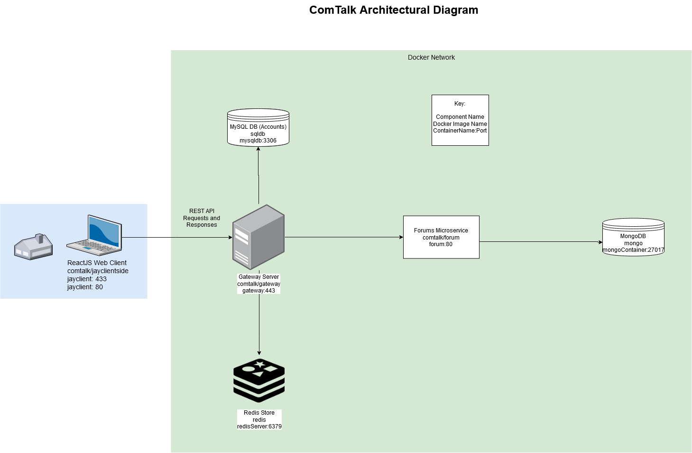

# ComTalk
## A repository for our UW Informatics 441 Final Project - ComTalk, the community forum

Comtalk application is an open, community forum application for users living in the Seattle community to post forums and discuss various topics around the same region. It addresses the lack of social interaction, loneliness, and boredom with the current ongoing COVID-19 pandemic. After a successful deployment, we are considering expanding beyond the Seattle region. However, Comtalk will be Seattle only for now.

With the ComTalk platform, users will have the ability to create forums discussing various topics where they will be validated by the moderators to ensure appropriateness. They will be able to like/dislike the forums being posted by others, as well as report any forums that might violate the content policies and guidelines. Since ComTalk is currently targeted to people living in the Seattle area (though it would potentially expand to other cities and regions in the US), residents in this region will benefit from using the application where they will be able to create an online community to discuss a wide variety of topics and maintain social wellness while meeting new people online, especially now during the COVID-19 pandemic. As developers, and as residents impacted severely from the pandemic, we have experienced and understood the various mental and physical struggles that people have been going through. We hope to provide a flexible and safe online platform where people can form new and lasting relationships, allowing them to support each other during these difficult times. 

 

Sharing link: https://drive.google.com/file/d/1ABDcMIL3H_FjReHX7tb6yyf56RIsr27w/view?usp=sharing

In case of future changes, update the digram at above link. UW Gmail Account required

# User Stories

As a local community member .....

I want to be able to create an account on my community forum.

I want to be able to log in and out of my existing account. 

I want to be able to see a list of forums for my local community.

I want to be able to create a new forum to speak with members of my local community.

I want to be to view the posts on a forum and read what my community members are saying.

I want to be able to make posts on a forum and speak with my fellow community members. 

# Endpoints

 Endpoint       | Method  | Response    |  Description |
| :------------- | :----------: | -----------: | -----------: |
|  /v1/Seattle/sessions | POST   | 201: Created    | Authentication, Creating a New Session |
|       |       |  400: Bad Request                 | Error in Request  |
|       |       | 500: Internal Server Error        | Internal Error |
|       |       |                                    |  |
|  /v1/Seattle/sessions/ | GET   | 200: OK   | Get Data for a Specific Session |
|       |       |  403: Forbidden                | Forbidden if not authenticated  |
|       |       |  400: Bad Request                 | Error in Request  |
|       |       | 500: Internal Server Error        | Internal Error |
|       |       |                                    |  |
|  /v1/Seattle/sessions/ | DELETE   | 200: OK   | Log Out, End Session |
|       |       |  403: Forbidden                | Forbidden if not current user  |
|       |       |  400: Bad Request                 | Error in Request  |
|       |       | 500: Internal Server Error        | Internal Error |
|       |       |                                    |  |
|  /v1/Seattle/users | POST   | 201: Created   | Create a New User |
|       |       |  400: Bad Request                 | Error in Request  |
|       |       | 500: Internal Server Error        | Internal Error |
|       |       |                                    |  |
|  /v1/Seattle/users/ | GET   | 201: Created   | Get A User's Data |
|       |       |  401: Unauthorized                | Forbidden if not authenticated |
|       |       |  404: Not Found                | User Not Found |
|       |       |  400: Bad Request                 | Error in Request  |
|       |       | 500: Internal Server Error        | Internal Error |
|       |       |                                    |  |
|  /v1/Seattle/forum | POST   | 201: Created   | Create a New Forum |
|       |       |  400: Bad Request                 | Error in Request  |
|       |       | 500: Internal Server Error        | Internal Error |
|       |       |                                    |  |
|  /v1/Seattle/forum | GET   | 200: 0K   | Get List of all Forums |
|       |       |  400: Bad Request                 | Error in Request  |
|       |       | 500: Internal Server Error        | Internal Error |
|       |       |                                    |  |
|  /v1/Seattle/forum/ | GET   | 200: 0K   | Get 200 Most Recent Messages in this Forum |
|       |       |  400: Bad Request                 | Error in Request  |
|       |       | 500: Internal Server Error        | Internal Error |
|       |       |                                    |  |
|       |       |                                    |  |
|  /v1/Seattle/forum/ | POST   | 201: Created   | Create a New Post on this forum |
|       |       |  400: Bad Request                 | Error in Request  |
|       |       | 500: Internal Server Error        | Internal Error |
|       |       |                                    |  |
|  /v1/Seattle/forum/ | DELETE   | 201: Created   | Delete this forum and all messages in it|
|       |       |  400: Bad Request                 | Error in Request  |
|       |       | 500: Internal Server Error        | Internal Error |
|       |       |                                    |  |
